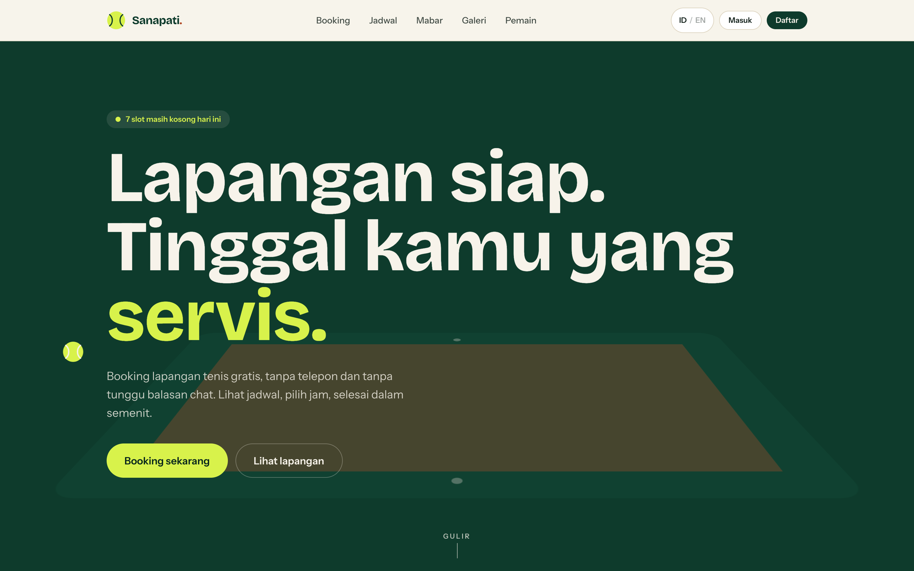
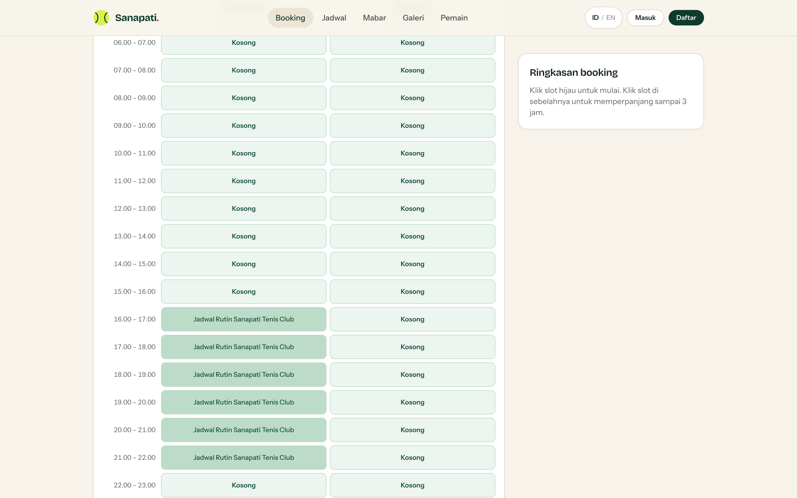
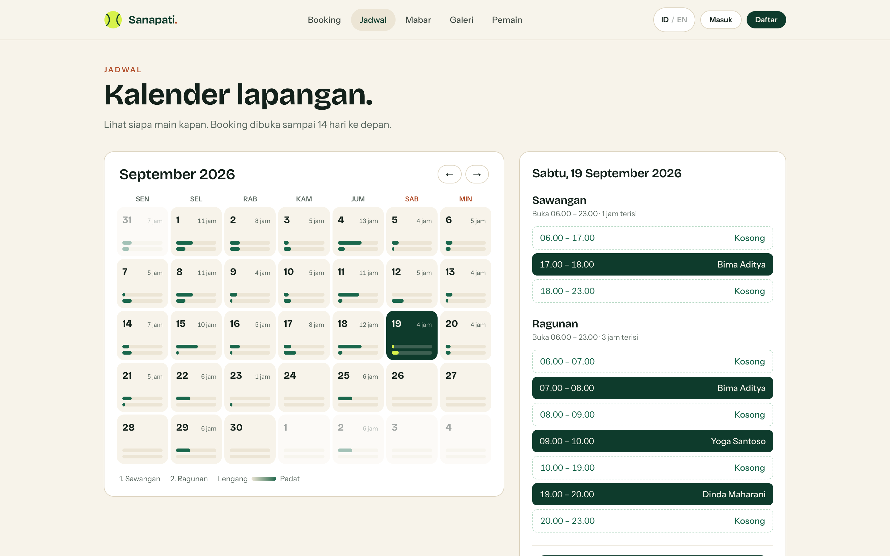
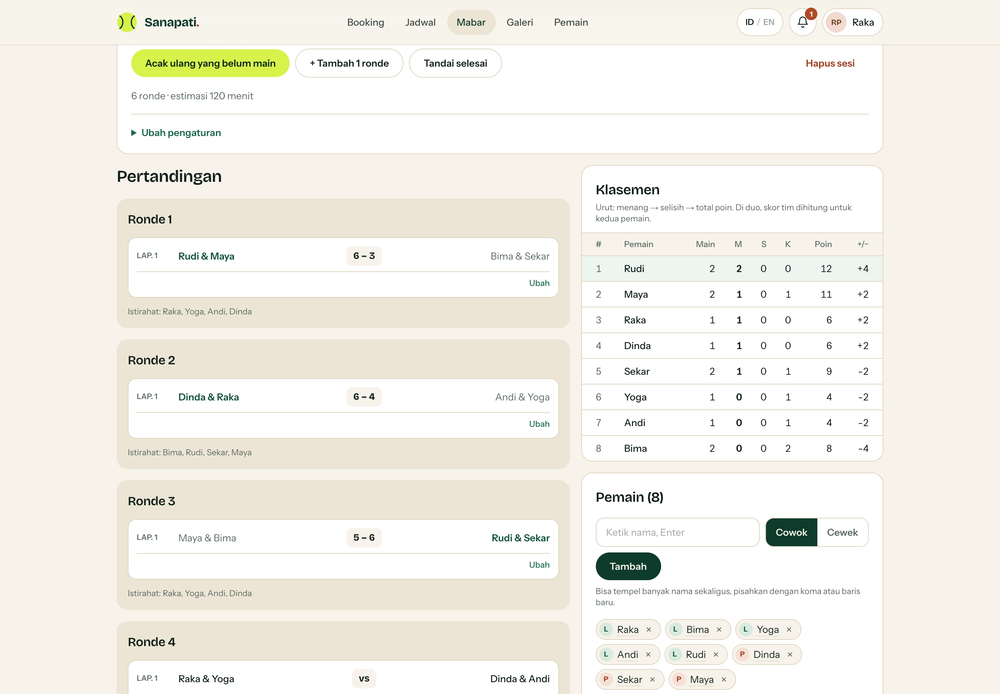
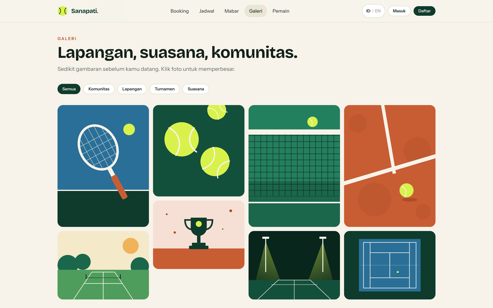
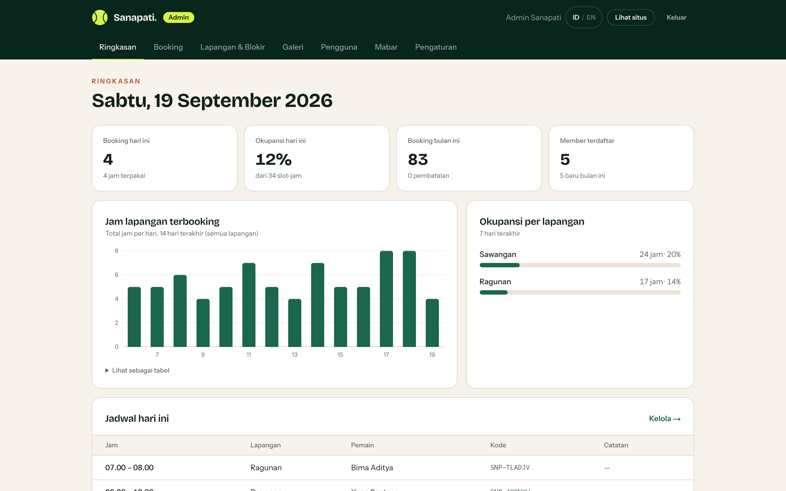
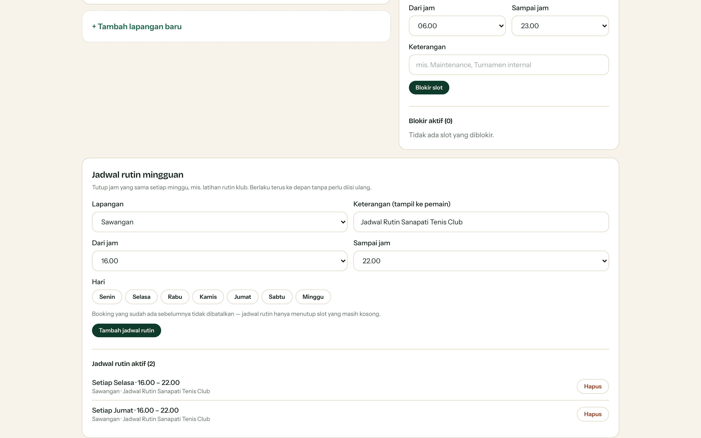
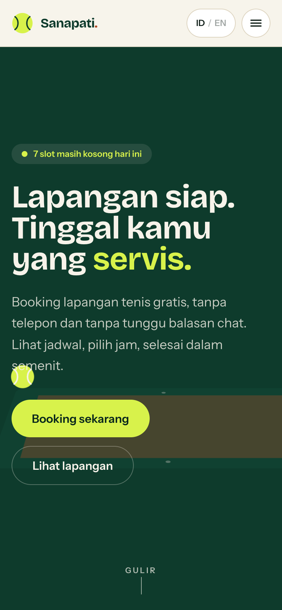
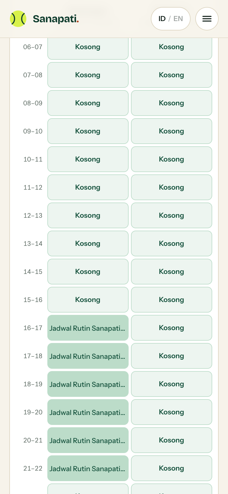

# Sanapati Tenis

[](https://sanapati-tenis.vercel.app)
[](LICENSE)
[](https://nextjs.org)
[](https://www.typescriptlang.org)
[](https://tailwindcss.com)
[](https://turso.tech)

Website komunitas tenis dengan booking lapangan online — **gratis** (tanpa harga/pembayaran), dua lapangan: **Sawangan** dan **Ragunan**, dua bahasa (Indonesia/Inggris). Next.js 15 (App Router) + TypeScript + Tailwind CSS v4 + SQLite (file lokal, atau Turso di produksi).

> **Live:** https://sanapati-tenis.vercel.app

## Tampilan



| Booking | Jadwal (kalender) |
| --- | --- |
|  |  |
| Papan lapangan × jam. Slot hijau bisa diklik; jam yang dipakai jadwal rutin klub tertutup otomatis. | Kalender bulanan dengan bar kepadatan, plus rincian per jam untuk tanggal yang dipilih. |

| Mabar / matchmaking | Galeri |
| --- | --- |
|  |  |
| Masukkan nama, sistem mengacak pasangan & lawan secara adil, lalu skor dan klasemen terisi otomatis. | Filter kategori dengan lightbox. |

| Admin — ringkasan | Admin — jadwal rutin mingguan |
| --- | --- |
|  |  |
| Statistik harian, grafik jam terbooking, okupansi per lapangan. | Sekali atur, jam yang sama tertutup setiap minggu. |

**Tampilan di HP**

<p>
  
  
</p>

## Menjalankan

```bash
npm install
npm run dev          # http://localhost:3000
```

Database SQLite dibuat otomatis di `data/sanapati.db` saat pertama kali diakses, lengkap dengan data contoh
(2 lapangan, 5 pemain, booking 3 minggu terakhir, galeri). Hapus folder `data/` untuk mengulang dari awal.
Kolom/tabel baru ditambahkan lewat migrasi aditif di `src/lib/db.ts`, jadi update kode tidak menghapus data.

| Akun demo | Email | Password |
| --- | --- | --- |
| Admin | `admin@sanapati.id` | `admin123` |
| Pemain | `raka@contoh.id` (juga dinda/bima/sekar/yoga) | `tenis123` |

> Akun demo di atas hanya dibuat di mode development. Di produksi hanya akun admin yang dibuat, dengan password dari `ADMIN_PASSWORD`
> (lihat `.env.example`); `SESSION_SECRET` wajib diisi, aplikasi menolak jalan di produksi tanpa secret ≥ 32 karakter.

## Fitur

| Fitur | Halaman | Catatan |
| --- | --- | --- |
| Landing page | `/` | Scroll-driven: hero 3D yang "diterbangi kamera", langkah booking dengan mockup hidup, panel lapangan bergeser horizontal, galeri parallax. Data slot & lapangan tetap dari database |
| Booking | `/booking` | Papan lapangan × jam, pilih 1–3 jam berurutan, maksimal 14 hari ke depan |
| Jadwal (kalender) | `/jadwal` | Kalender bulanan + detail harian per lapangan, publik. Nama hanya tampil untuk pemain berprofil publik |
| Mabar / matchmaking | `/mabar` | Dashboard publik. Sesi mabar (rotasi adil) atau turnamen (gugur), solo/duo, aturan gender, target skor, rencana durasi, pemerataan jumlah main, input skor, klasemen/bagan otomatis |
| Booking saya | `/booking-saya` | Akan datang + riwayat, kode booking |
| Pembatalan | `/booking-saya` | Mandiri sampai 6 jam sebelum main, wajib pilih alasan; slot langsung dibuka lagi |
| Pengingat jadwal | lonceng di header | Toast di website + notifikasi browser + file kalender `.ics` ber-alarm; waktu pengingat diatur di `/akun` |
| Akun | `/daftar`, `/masuk`, `/akun` | Sesi JWT di cookie httpOnly, password bcrypt, ganti password, foto profil |
| Lupa password | `/lupa-password` | Link sekali-pakai (1 jam). Via email bila `RESEND_API_KEY` diisi; tanpa itu admin membuat link dari halaman Pengguna |
| Daftar & profil pemain | `/pemain`, `/pemain/[id]` | Level, gaya main, statistik jam main, lapangan favorit; bisa diset privat |
| Galeri | `/galeri` | Filter kategori + lightbox |
| Admin dashboard | `/admin` | Kontrol penuh, lihat bagian **Admin** di bawah |
| Dua bahasa | tombol `ID / EN` di header | Tersimpan di cookie; berlaku untuk semua halaman, pesan error, format tanggal/jam, dan file kalender |

## Admin

| Tab | Yang bisa dilakukan |
| --- | --- |
| Ringkasan | Statistik hari ini/bulan ini, grafik jam terbooking, okupansi per lapangan, jadwal hari ini |
| Booking | Cari/filter; **buat booking atas nama pemain** (tidak terkena aturan pemain), ubah/pindah jadwal & lapangan, batalkan, pulihkan, hapus permanen |
| Lapangan & Blokir | Tambah/ubah/nonaktifkan/**hapus** lapangan, jam buka per lapangan, blokir slot sekali jalan, dan **jadwal rutin mingguan** |
| Galeri | Unggah, ubah judul/kategori, hapus |
| Pengguna | Tambah pengguna; halaman kelola per user: ubah semua data + email, set password, role, **bekukan akun**, link reset, riwayat booking; hapus akun |
| Mabar | Semua sesi: kelola, kunci/buka, tandai selesai, hapus |
| Pengaturan | Aturan booking, buka/tutup pendaftaran, pengumuman (banner seluruh situs, 2 bahasa), email kontak |

Pengaman: admin tidak bisa menurunkan, membekukan, atau menghapus akunnya sendiri. Semua aksi yang tidak bisa diurungkan lewat dialog konfirmasi.
Setiap server action mengecek role sendiri — menyembunyikan tombol saja tidak dianggap pengamanan.

## Aturan bisnis

Aturan di bawah bisa diubah admin di **/admin/pengaturan** (tersimpan di tabel `settings`); nilai di [`src/lib/time.ts`](src/lib/time.ts) hanya default awal:

- Jam operasional default 06.00–23.00 **WIB** (zona waktu klub, tidak tergantung server/browser); bisa diatur per lapangan di admin
- Maksimal 3 jam per booking, 5 booking aktif per pemain, booking paling jauh 14 hari ke depan
- Batas pembatalan mandiri: 6 jam sebelum main (admin bisa membatalkan kapan saja)

Cek bentrok + insert berjalan dalam satu transaksi SQLite, jadi dua orang tidak bisa mengambil slot yang sama.

## Jadwal rutin mingguan

Untuk sesi tetap klub (mis. Selasa & Jumat 16.00–22.00 di Sawangan), admin mengaturnya sekali di **Lapangan & Blokir → Jadwal rutin mingguan**.

- Aturan disimpan sebagai pola (`recurring_blocks`: lapangan + hari + jam), lalu dihitung saat halaman dirender — bukan dibuat sebagai ribuan baris booking.
  Jadi berlaku terus ke depan tanpa cron dan tanpa perlu diisi ulang.
- Booking **baru** di jam itu ditolak server dengan pesan yang jelas; booking yang **sudah ada tidak dibatalkan** — admin hanya diberi tahu berapa yang bentrok.
- Admin tetap bisa menimpa (booking atas nama pemain / blokir manual) karena jalur admin melewati aturan pemain.
- Keterangannya tampil ke pemain: ringkas ("Klub") di papan booking, lengkap di kalender.

## Mabar / matchmaking

Logika pengacakan ada di [`src/lib/matchmaking.ts`](src/lib/matchmaking.ts) — fungsi murni tanpa database, jadi mudah diuji.

- **Mabar**: tiap ronde mendahulukan pemain yang paling sedikit main, lalu memilih susunan dengan pengulangan pasangan/lawan paling sedikit.
  Jumlah ronde = `durasi ÷ menit per match`; bila "semua main minimal N×" diisi, berhenti begitu target tercapai.
- **Turnamen**: sistem gugur; jumlah peserta yang bukan kelipatan 2 diberi *bye*; pemenang otomatis maju. Skor babak awal terkunci setelah babak berikutnya dimainkan.
- **Aturan gender**: bebas · sesama gender · mix (tiap tim 1 cowok + 1 cewek, khusus duo).
- Hak akses: **membuat sesi** butuh login. Setelah itu, selama sesi *terbuka* (default), **siapa pun tanpa login** bisa mengisi/mengubah skor,
  menambah pemain, dan membetulkan nama/gender. Acak ulang, ubah pengaturan, hapus pemain, tandai selesai, dan hapus sesi tetap khusus pembuat sesi + admin.
  Pembuat sesi bisa mengunci sesi (centang di "Ubah pengaturan"); sesi yang ditandai selesai otomatis terkunci. Tulisan anonim dibatasi 40/menit per IP.
- Nama pemain berupa teks bebas (tidak harus punya akun).

## Landing page scroll-driven

Tanpa library animasi. [`ScrollScene`](src/components/landing/ScrollScene.tsx) hanya menulis progres scroll ke CSS (`--p` 0..1 dan `data-step`);
seluruh gerak ada di `globals.css` dan hanya memakai `transform`/`opacity`, jadi tidak ada re-render React saat scroll.

- `mode="pin"`: isi ditahan di layar selama `screens` layar scroll (hero, cara booking, lapangan). `mode="view"`: progres saat elemen melintasi layar (galeri, CTA).
- Tanpa JavaScript halaman tetap tampil utuh (kondisi awal); dengan `prefers-reduced-motion` semua pin/geser dimatikan dan konten tersusun seperti halaman biasa.
- Menambah lapangan aktif otomatis menambah panel di adegan lapangan.

## Dua bahasa (i18n)

Semua teks ada di kamus [`src/lib/i18n.ts`](src/lib/i18n.ts) + [`src/lib/i18n-extra.ts`](src/lib/i18n-extra.ts) (`id` dan `en`; TypeScript memaksa keduanya punya kunci yang sama).

- Server component / action: `const { t, f } = await getI18n()` dari `lib/i18n-server.ts`
- Client component: `const { t, f } = useI18n()` dari `components/I18nProvider.tsx`
- `t` = teks, `f` = format tanggal/jam/hitung mundur sesuai bahasa
- Nilai pilihan (level, permukaan, kategori galeri, alasan batal) disimpan di database dalam bahasa Indonesia dan diterjemahkan saat tampil lewat `opt(t, nilai)`
- Konten yang diketik user/admin (bio, deskripsi lapangan, judul foto, catatan) tampil apa adanya, tidak diterjemahkan

## Struktur

```
src/lib/          db (skema + migrasi + seed), auth, bookings, time (WIB & aturan), i18n, matchmaking (mesin acak), mabar (data sesi),
                  password-reset, uploads (validasi isi file)
src/app/actions/  server actions: auth, booking, account, admin, mabar, locale — semua validasi & cek hak akses di sini
src/app/(site)/   halaman publik & pemain
src/app/admin/    dashboard admin (dijaga requireAdmin di layout + di setiap action)
src/app/api/      /api/reminders (data lonceng), /api/bookings/[code]/ics (kalender),
                  /api/gallery/[id]/unduh (unduh foto — perlu rute sendiri karena foto di Blob beda origin)
src/app/media/    menyajikan foto galeri hasil upload dari data/uploads
src/components/   komponen UI; yang interaktif bertanda "use client"
tests/            tes ujung-ke-ujung dengan browser sungguhan (lihat tests/README.md)
```

Tiap segmen rute punya `error.tsx` dan `loading.tsx` sendiri, jadi kegagalan database tidak
pernah menampilkan layar error mentah Next.js dan perpindahan halaman tidak pernah kosong.

## Tes

```bash
npm test              # build, lalu jalankan semua suite
npm run test:cepat    # pakai build yang ada
```

Lima suite dijalankan terhadap aplikasi sungguhan lewat Chrome: sapuan semua halaman (3 peran
× 2 bahasa), halaman error & memuat, galeri, jadwal rutin klub, dan uji penetrasi server action.
Perlu Chrome terpasang. Rinciannya di [tests/README.md](tests/README.md).

## Deploy

Aplikasi punya dua mode penyimpanan, dipilih otomatis dari environment variable:

| | Database | Foto unggahan | Cocok untuk |
| --- | --- | --- | --- |
| **Lokal** (default) | file SQLite di `./data` | `./data/uploads` | development, VPS, Railway/Fly dengan disk persisten |
| **Cloud** | [Turso](https://turso.tech) (`TURSO_DATABASE_URL`) | Vercel Blob (`BLOB_READ_WRITE_TOKEN`) | **Vercel** / serverless, yang sistem file-nya read-only |

### Vercel + Turso

1. **Turso**: buat akun di turso.tech → *Create Database* → salin **Database URL** (`libsql://…`) dan buat **token**.
2. **Vercel → Project → Storage**: *Create → Blob* dan hubungkan ke project (mengisi `BLOB_READ_WRITE_TOKEN` otomatis).
3. **Vercel → Settings → Environment Variables**: isi `TURSO_DATABASE_URL`, `TURSO_AUTH_TOKEN`, `SESSION_SECRET` (acak ≥ 32 karakter),
   `ADMIN_PASSWORD` (password admin pertama), dan `APP_URL`. Daftar lengkap ada di [`.env.example`](.env.example).
   Region fungsi Vercel diatur di [`vercel.json`](vercel.json) (`hnd1` = Tokyo) agar **satu wilayah dengan database Turso**.
   Satu halaman menjalankan beberapa query; kalau server dan database beda benua, tiap query menambah ±200 ms. Pindah region Turso → ubah juga di sini.
4. **Redeploy**. Pada request pertama tabel dibuat otomatis dan akun admin dibuat dari `ADMIN_EMAIL`/`ADMIN_PASSWORD`.
   Akun dan booking contoh **tidak** dibuat di produksi.
5. Opsional, membawa data lokal: `node scripts/push-to-turso.mjs --yes` (lihat komentar di dalam skripnya).

Tanpa `TURSO_DATABASE_URL` di Vercel, aplikasi berhenti dengan pesan error yang jelas, bukan error 500 yang membingungkan.

### Server dengan disk sendiri

```bash
npm run build && npm run start     # set DATA_DIR ke volume persisten bila perlu
```

### Catatan teknis lapisan data

- Semua akses database lewat helper async di [`src/lib/db.ts`](src/lib/db.ts): `db.get/all/run`, `db.batch` (beberapa tulis, atomik, satu round-trip),
  `db.tx` (transaksi interaktif — dipakai untuk cek-bentrok-lalu-insert saat booking supaya tidak terjadi double booking).
- `npm run lint:promises` memeriksa promise yang lupa di-`await`. Jalankan setelah mengubah kode server: di serverless, penulisan yang tidak ditunggu bisa tidak pernah selesai.
- Pembatas laju (login, isi skor anonim) disimpan di memori proses; di serverless tiap instance menghitung sendiri, jadi sifatnya peredam, bukan pagar mutlak.

## Belum termasuk

- Pengingat via email/WhatsApp (butuh penyedia pihak ketiga + cron); pengingat saat ini berbasis browser & kalender
- Galeri: pengunjung boleh mengirim foto tanpa akun, tapi selalu lewat antrean persetujuan admin
  (bisa dimatikan di Pengaturan). Belum ada pagination — semua foto dimuat sekaligus
- Mabar: pemain berupa teks bebas, belum terhubung ke akun/profil pemain; turnamen baru sistem gugur (belum ada round-robin / perebutan juara 3)

## Lisensi

[MIT](LICENSE)
